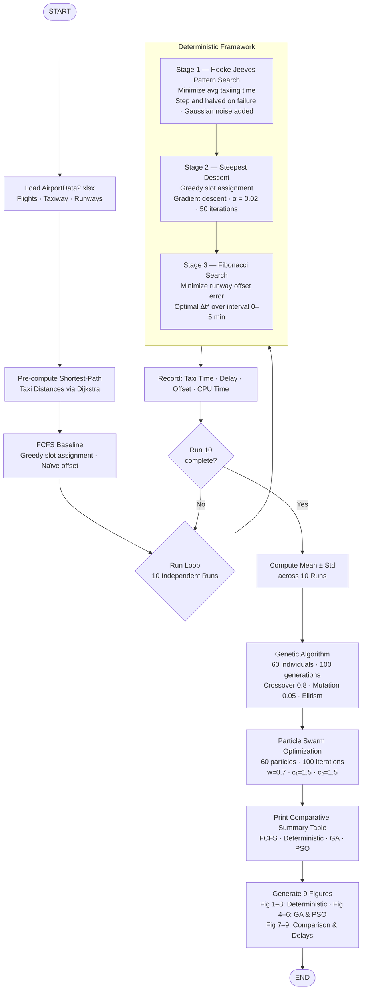

# Optimization of Airport Runway Operations: Minimizing Taxiing Time, Reducing Departure Delays, and Optimal Runway Assignment

This repository presents the MATLAB implementation of a unified, three-stage deterministic optimization framework for airport ground operational efficiency.

---

## 1. Description

Airport ground operations — taxiing, runway slot assignment, and departure scheduling — constitute critical bottlenecks in global aviation.

Stochastic metaheuristics such as the Genetic Algorithm (GA) and Particle Swarm Optimization (PSO) impose considerable computational overhead and yield non-reproducible results. The First-Come-First-Served (FCFS) heuristic, similarly, fails to capture the interdependencies among taxiing routes, slot availability, and runway utilization.

The present work introduces a lightweight, fully deterministic alternative structured as a sequential three-stage pipeline. Each stage is aligned with a distinct operational sub-objective:

* **Stage 1 (Taxiing Time):** Minimizes average taxiing time using the **Hooke-Jeeves Pattern Search** method.
* **Stage 2 (Departure Delay):** Minimizes total squared departure delay using the **Steepest Descent (Gradient Descent)** method.
* **Stage 3 (Runway Offset):** Minimizes the global runway schedule offset error using **Fibonacci Search**.

The framework is benchmarked against the **FCFS** heuristic, **GA**, and **PSO** across ten independent experimental trials.

---

## 2. Dataset Information (Purpose-Built Dataset)

All experiments are conducted using a purpose-built dataset (`AirportData2.xlsx`) constructed to replicate conditions at a medium-sized airport, which contains three sheets:

1. **`Flights` Sheet:**
   * `FlightID`: Unique identifier for each of the 100 flights.
   * `ArrivalTime`: Scheduled arrival time in HHMM (Hours Hours Minutes Minutes) format.
   * `DepartureTime`: Scheduled departure time in HHMM format.
   * `GateNode`: Starting gate node (1–20) from which the aircraft commences taxiing.

2. **`Taxiway` Sheet:**
   * A 21 × 21 weighted adjacency matrix encoding the taxiway network topology.
   * Node 21 denotes the runway threshold.
   * Non-zero entries represent direct transit time in minutes; zero entries indicate no direct link.

3. **`Runways` Sheet:**
   * `SlotTime`: Available departure slot times in HHMM format, expanded into a 15-minute grid covering the full operational window.

### Assembly and Source

The dataset is constructed using parameters representative of medium-sized airport operations: 100 flights, a 21-node taxiway graph, and 85 runway slots. Parametric bounds — taxi times of 5–25 minutes and departure delays of 2–15 minutes — are derived from internationally recognized civil aviation standards.

---

## 3. Code Information

The repository consists of a single MATLAB script encapsulating the complete optimization implementation. The script:

* Loads the dataset from the relative filepath `"AirportData2.xlsx"`.
* Pre-computes shortest-path taxi distances using Dijkstra's algorithm.
* Executes the FCFS baseline and the three-stage deterministic framework over 10 independent runs.
* Evaluates GA and PSO comparator algorithms over 10 independent runs.
* Outputs a structured comparative performance table to the MATLAB Command Window.
* Generates 9 graphical figures covering taxi times, schedule alignment, and convergence behavior.

---

## 4. Usage Instructions

The reader is kindly requested to follow the procedure below to reproduce the experimental results:

1. Place `AirportData2.xlsx` and the MATLAB script in the same working directory.
2. Launch MATLAB and set that directory as the active Current Folder.
3. Open the script in the MATLAB Editor and press **Run**, or invoke it from the Command Window.
4. **Console Output:** Displays loading status, FCFS baseline statistics, per-run progress, and a final comparative summary table for all four scheduling methods.
5. **Figure Output:** Generates 9 figures — Figures 1–3 (Deterministic Results), Figures 4–6 (GA and PSO Convergence), Figure 7 (Comparative Bar Chart), Figure 8 (Computational Cost), and Figure 9 (Per-Flight Delay Distribution).

---

## 5. Requirements

Ensure `AirportData2.xlsx` is in the same directory as the script.

---

## 6. Methodology


````
